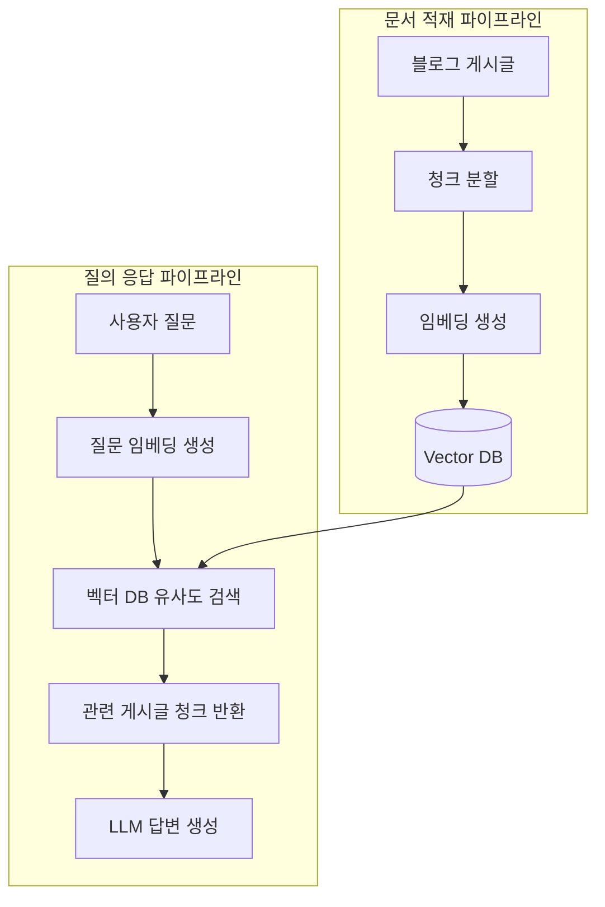

## 게시글은 쌓이는데 왜 나는?

먼저 말씀드리면 저는 이전에도 개발 블로그를 운영한 적이 있습니다. 그때도 여러가지 문제점이 있었지만, 제가 느꼈던 문제점 중 하나는 분명 개발 블로그를 작성하고 있는데도 제 지식이 늘어난다는 느낌은 받지 못했다는 것입니다.

이상하지 않나요? 블로그 글은 늘어나는데 지식은 늘어나고 있지 않다니요. 물론 게시글의 질이 낮아서, 혹은 제가 블로그를 주기적으로 정독하지 않아서 이런 문제가 발생할 수도 있었을 겁니다. 하지만 제가 내린 결론은 게시글 단위의 지식을 쉽게 참조할 수 있는 무언가가 없다는 점이었습니다.

## 지식의 감옥, 게시글

분명 게시글은 지식의 저장물입니다. 하지만 게시글은 지식을 알아서 제공해주지 않습니다. 원하는 지식이 포함된 글을 **1. 찾아서 2. 읽고 3. 이해하는** 과정이 필요하죠.&#x20;

문제는 인간은 망각의 동물이고 기존의 검색 시스템은 내 의도를 이해하지 못한다는 점입니다. 내가 참조하고 싶은 지식이, 내가 참조하고 싶을 때, 검색에 걸릴 만한 특정 단어로 적혀있을지는 알 수가 없죠. 때문에 블로그에 게시글을 쓰고 나면 지식은 게시글에 갇히게 됩니다.

그렇다면 어떻게 하면 이 문제를 해결할 수 있을까요? 내가 원하는 개념을 이해하고 이를 알아서 가져와주는 무언가가 있다면 가능하지 않을까요?

## 그래서 RAG

**RAG**(Retrieval-Augmented Generation)란, 질문이 들어오면 관련된 문서를 먼저 검색해서 가져온 뒤, 그 내용을 바탕으로 AI가 답변을 생성하는 방식입니다.

핵심은 검색 방식에 있습니다. 임베딩 모델은 텍스트를 의미를 담은 숫자 벡터로 변환하는데, 이를 활용하면 :u[단어가 정확히 일치하지 않아도 의미가 비슷한 내용을 찾아올 수 있습니다]. RAG는 바로 이 벡터 검색을 활용해 관련 문서를 가져오는 방식이죠. 즉, 이를 활용하면 블로그에 쌓인 글들이 단순한 아카이브가 아니라 나와 대화할 수 있는 지식 베이스가 되는 겁니다.

## 어떻게 만들까?

전체 구조는 크게 두 단계로 나뉩니다. 게시글을 벡터로 변환해 저장하는 **문서 적재 파이프라인**과, 질문을 받아 관련 내용을 찾고 답변을 생성하는 **질의 응답 파이프라인**입니다.



### 문서 적재 파이프라인

문서 적재 파이프라인에서는 게시글을 임베딩 모델을 통해 벡터로 변환하고 Vector DB에 저장합니다. 처음 만드는 것이니만큼 복잡한 청킹 전략보다 전체 흐름이 동작하는 것을 우선으로 삼았고, 일단은 게시글 하나를 통째로 하나의 청크로 취급했습니다.

저는 이 벡터 DB를 사용하기 위해 Supabase를 선택했는데요. 별도의 벡터 DB를 운영하는 것보다 RAG 서비스 자체에 집중하고 싶었고, Supabase는 pgvector를 지원하기 때문에 추가 인프라 없이 바로 시작할 수 있었거든요. 그리고 무엇보다 무료로 바로 시작할 수 있다는 점도 컸습니다.

먼저 테이블은 정의했습니다. 청크의 내용과 임베딩 벡터를 함께 저장하고, slug로 원본 게시글을 참조할 수 있도록 했죠.

```sql title="supabase에서 chunks 테이블 정의"
create table chunks (
  id uuid primary key default gen_random_uuid(),
  content text not null,
  embedding vector(768),
  slug text not null,
  created_at timestamptz default now(),
  tags text[],
  category text,
  content_type text
);
```

또한 질문이 들어왔을 때 유사한 청크를 검색할 수 있는 함수도 정의했습니다. 코사인 유사도를 기준으로 threshold 이상인 청크만 가져오고, 최대 개수도 제한할 수 있도록 했습니다.

```sql title="쿼리와 유사한 임베딩 값을 가지는 청크를 매칭하는 함수"
create or replace function match_chunks(
  query_embedding vector(768),
  match_count int default 5,
  match_threshold float default 0.5
)
returns table (
  id uuid,
  content text,
  slug text,
  tags text[],
  category text,
  content_type text,
  similarity float
)
language plpgsql
as $$
begin
  return query
  select
    chunks.id,
    chunks.content,
    chunks.slug,
    chunks.tags,
    chunks.category,
    chunks.content_type,
    1 - (chunks.embedding <=> query_embedding) as similarity
  from chunks
  where 1 - (chunks.embedding <=> query_embedding) > match_threshold
  order by chunks.embedding <=> query_embedding
  limit match_count;
end;
$$;
```

위 함수는 SQL 단에서 정의된 RPC 함수인데요. 이를 통해 SQL에 직접 접근하지 않고도 벡터 검색을 호출할 수 있습니다. 클라이언트는 임베딩된 질문 벡터만 넘겨주면 되고, 유사도 계산은 DB 안에서 처리됩니다.

이제 DB 쪽이 완료되었으니 클라이언트 단에서 문서를 임베딩해서 저장을 요청하는 코드도 필요하겠죠. 저는 다양한 임베딩 모델을 유연하게 사용하고 싶어서 OpenRouter를 활용했고, Vercel의 AI SDK를 통해 간단하게 구현했습니다.

```ts title="scripts/ingest.ts"
const { embedding } = await embed({
  model: openrouter.textEmbeddingModel("qwen/qwen3-embedding-8b", { extraBody: { dimensions: 768 } }),
  value: content,
});

await supabase.from("chunks").insert({
  slug, content, embedding, tags, category, content_type: contentType,
});
```

임베딩 모델로는 qwen/qwen3-embedding-8b를 선택했습니다. OpenAI의 text-embedding-3-large나 Google의 Gemini Embedding도 고려했지만, 아무래도 오픈소스 모델이라 저렴하게 사용할 수 있다는 점이 가장 컸습니다. 거기다 다른 모델 대비 한국어 지원이 우수하고, 임베딩 차원을 유연하게 조정할 수 있으며, 필요하다면 로컬에서도 직접 서빙할 수 있다는 점도 물론 매력적이었고요.


이제 이 스크립트를 실행해서 모든 파일을 읽어와 문서를 임베딩해 벡터로 변환, DB에 저장하면 위처럼 DB에 청크와 벡터 값이 저장되게 됩니다.

### 질의 응답 파이프라인

이제 문서를 모두 저장했으니 사용자가 쿼리를 입력하고, 답변을 받아오는 코드를 작성해야 했습니다. 제 블로그는 Next.js를 사용하고 있기 때문에 Route Handler를 통해 간단하게 POST로 요청하는 API를 구현했습니다.

이 질의 응답 파이프라인에서 눈여겨볼 부분은 질문을 그대로 임베딩하지 않는다는 점입니다. 대화가 이어질 때 "아까 그거 코드 보여줘" 같은 질문은 맥락 없이는 제대로 검색이 안 되거든요. 그래서 이전 대화를 반영해 벡터 검색에 최적화된 독립적인 쿼리로 먼저 재작성합니다.

```ts title="api/rag/route.ts"
const { text: rewrittenQuery } = await generateText({
  model: openrouter("openai/gpt-oss-120b:free"),
  messages: [
    {
      role: "system",
      content: `이전 대화를 참고해서 마지막 질문을 벡터 검색에 최적화된 독립적인 쿼리로 재작성해줘.
      - 이전 대화와 연결된 질문이면 맥락을 포함해서 재작성
      - 새로운 주제면 그대로 유지
      - 재작성된 쿼리만 출력, 다른 말 하지 마
      - 한국어로 작성`,
    },
    ...(await convertToModelMessages(chatHistory)),
    { role: "user", content: question },
  ],
});
```

그리고 재작성된 쿼리를 임베딩해 유사한 청크를 검색합니다. 한 가지 주의할 점은 모델마다 문서용과 쿼리용 임베딩 방식이 다를 수 있다는 점입니다. qwen/qwen3-embedding-8b의 경우 쿼리 임베딩 시에는 앞에 `Instruct: ...` 형태의 지시문을 붙여야 검색 품질이 더 좋아집니다.

```ts title="api/rag/route.ts"
const { embedding } = await embed({
  model: openrouter.textEmbeddingModel("qwen/qwen3-embedding-8b", {
    extraBody: { dimensions: 768 },
  }),
  value: `Instruct: Given a web search query, retrieve relevant passages that answer the query\nQuery: ${rewrittenQuery}`,
});

// @char Tooltip {23-34} content="앞에서 정의했던 match_chunks 함수를 RPC로 호출합니다."
const { data } = await supabase.rpc("match_chunks", {
  query_embedding: embedding,
  match_count: 5,
  match_threshold: 0.5,
});
```

그리고 마지막으로 검색된 청크를 컨텍스트로 묶어 생성 모델에 전달합니다. 생성 모델로는 openai/gpt-oss-120b:free를 사용했습니다. 이유는 단순한데요. 바로 GPT라는 이름값과 무료였기 때문입니다.

```ts title="api/rag/route.ts"
const streamResponse = streamText({
  model: openrouter("openai/gpt-oss-120b:free"),
  messages: [
    {
      role: "system",
      content: "너는 블로그 내용을 기반으로 질문에 답하는 어시스턴트야. 주어진 컨텍스트만 참고해서 질문에 답변해줘.",
    },
    ...(await convertToModelMessages(chatHistory)),
    {
      role: "user",
      content: `
너는 example의 개발 블로그 내용을 기반으로 질문에 답하는 어시스턴트야.

규칙:
- 주어진 컨텍스트에 질문과 관련된 내용이 있으면 그것을 바탕으로 답변해
- 컨텍스트에 관련 내용이 없거나 블로그와 무관한 질문이면 "블로그에서 관련 내용을 찾지 못했어요"라고 솔직하게 말해
- 컨텍스트에 없는 내용을 지어내지 마

컨텍스트

${context}

질문: ${question}
      `.trim(),
    },
  ],
});
```

이제 프론트 쪽에서 이 응답을 받을 적절한 UI를 붙이면 아래처럼 블로그의 내용을 바탕으로 설명해주는 RAG가 탄생합니다.


## 마무리 - 이제 돌아가긴 하는데

이렇게 해서 블로그에 RAG를 붙이는 것 자체는 성공했습니다. 벡터 DB를 구축하고, 게시글을 임베딩해서 저장하고, 질문이 들어오면 대답하기까지… 서론에서 말했던 것처럼, 드디어 블로그에 쌓인 글들이 단순한 아카이브가 아니라 나와 대화할 수 있는 지식 베이스가 되기 시작한 거죠.

하지만 정말로 여기서 끝내도 되는 걸까요? 일단 검색은 잘 되는 느낌이긴 한데… 잘 된다는 게 뭐죠?
