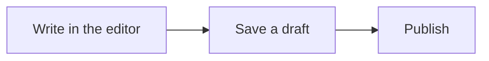

This post holds every body element and every block of the example blog, written in the directive notation (`:::callout{…}`, `:name[text]{…}`). Open it on the public page and in the admin editor, and compare the two. The [follow-up post](/ko/posts/cms-elements-details) links back here, the [memo](/ko/memos/showcase-memo) is a short note, and the [Monti repository](https://github.com/monti-cms/monti) is an external link.

## Text and inline marks

A paragraph with **bold**, *italic*, ~~strikethrough~~, `inline code`, :u[underline], x:sup[2] and H:sub[2]O in one sentence. This line ends with a hard break<br />
and this one starts after it.

### Third level heading

Text under an h3 heading.

#### Fourth level heading

Text under an h4 heading, with a note that needs a footnote.[^note]

## Lists

- An unordered item
- Another item
  - A nested item
    - A deeper nested item
  - A second nested item
- A last item

1. First step
2. Second step
   1. A nested step
   2. Another nested step
3. Third step

- [x] A finished task
- [ ] An open task
  - [x] A finished nested task
  - [ ] An open nested task

## Quote and rule

> A block quote is plain Markdown. It can hold **bold text** and a [link](https://example.com).

---

## Table

| Element | Count | Notes |
| :------ | :---: | ----: |
| Heading | 3 | left, center, right |
| Code block | 4 | with notes |
| List | 3 | nested |

## Code blocks

A block with a title, line numbers, a highlighted line and a note on a word.

```ts title="src/showcase/highlight.ts" lnum
// @line highlight {0-0}
// @char Tooltip {6-10} content="A note on this word"
const title = "CMS showcase";
const count = 3;
console.log(title, count);
```

Focus dims every line except the focused one.

```ts title="src/showcase/focus.ts" lnum
const before = 1;
// @line focus {0-0}
const focused = before + 1;
const after = focused + 1;
```

Added, removed, warning and error lines.

```ts title="src/showcase/marks.ts" lnum
// @line minus {0-0}
const old = "removed";
// @line plus {0-0}
const next = "added";
// @line warning {0-0}
const risky = "warning";
// @line error {0-0}
const broken = "error";
```

Lines that fold away until a reader opens them.

```ts title="src/showcase/collapse.ts" lnum
const visible = "always shown";
// @line collapse
const hiddenA = "folded line one";
const hiddenB = "folded line two";
// @line collapse end
console.log(visible, hiddenA, hiddenB);
```

## Math

$$
E = mc^2
$$

## Image

::image{src="/showcase/sample.svg" alt="A sample illustration with a circle and two hills" width="70%" caption="A sample image from the example blog's public folder"}

## Callouts

:::callout{variant="note"}
A note callout with the default title.
:::

:::callout{variant="tip" title="A tip with its own title"}
A tip can hold **bold text** and a [link](https://example.com).
:::

:::callout{variant="info"}
An info callout.
:::

:::callout{variant="warning" title="Watch out"}
A warning callout.
:::

:::callout{variant="danger"}
A danger callout.
:::

## Collapsible

:::collapsible{title="Click to open"}
Closed by default. Click the title to read this sentence.
:::

:::collapsible{title="Open from the start" defaultOpen}
This one is open when the page loads.
:::

## Tabs

::::tabs{defaultValue="npm"}
:::tab{label="npm"}
```sh
npm install @monti-cms/core
```
:::

:::tab{label="pnpm"}
```sh
pnpm add @monti-cms/core
```
:::

:::tab{label="yarn"}
```sh
yarn add @monti-cms/core
```
:::
::::

## Columns

::::columns{widths="60,40"}
:::column
**The wide column** holds the main text, and it takes sixty percent of the row.
:::

:::column
**The narrow column** holds a side note.
:::
::::

## Diagram and chart



```chart
chart bar
x month
show-values
series editor | Editor | chart-1
series public | Public page | chart-2

data
month | editor | public
Jan | 12 | 10
Feb | 18 | 16
Mar | 24 | 22
```

## Tooltip and text color

A :tooltip[hover term]{content="A tooltip shows a short explanation next to the text."} in a sentence, and :color[red text]{fg="#dc2626" fgDark="#f87171"} with a background :color[highlight]{bg="#fef08a" bgDark="#854d0e"} that follows the theme.

## Code explorer

A file tree with the code of the picked file.

:::code-explorer{open="src/app/page.tsx"}
```tsx title="src/app/page.tsx"
export default function Page() {
  return <main>Code explorer</main>;
}
```

```ts title="src/lib/db.ts"
export const db = connect();
```

```text title="public/"
```
:::

## Code link

The :code-ref[greet function]{to="c1"} below is linked from this sentence: hover or press the text and its lines light up, and the line has a back-link to here.

```ts title="src/showcase/greet.ts" lnum
// @line anchor {0-1} id="c1"
export function greet(name: string) {
  return `Hello, ${name}`;
}
console.log(greet("Monti"));
```

[^note]: A footnote is listed at the end of the post and links back to its mark.
