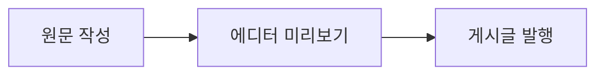

이 글은 CMS 에디터와 공개 게시글에서 지원하는 본문 요소를 한 번에 확인하기 위한 샘플입니다. 각 제목 아래에서 편집 상태와 실제 렌더링을 비교해 보세요.

## 구성 요소 빠른 목록

- **Callout**: note, tip, info, warning, danger 종류와 기본 제목, 직접 지정한 제목, 본문 없이 제목만 둔 상자를 확인합니다.
- **Collapsible**: 제목을 눌러 여닫고, 처음부터 열린 상태도 확인합니다.
- **TextAlign**: 왼쪽, 가운데, 오른쪽 문단 정렬을 비교합니다.
- **Tabs/Tab**: 탭 이름을 눌러 본문을 바꾸고, 처음 선택할 탭을 지정합니다. 탭은 2~8개까지 지원합니다.
- **Columns/Column**: 2~4단 본문을 나란히 배치합니다. 여기서는 3단을 사용합니다.
- **Image**: 사이트 파일 주소, 대체 텍스트, 캡션, 너비, 정렬, 장식 이미지, 자르기, 회전, 브라우저 도움말을 확인합니다. 미디어 라이브러리 ID 방식도 지원하지만 현재 라이브러리가 비어 있어 주소 방식으로 보여 줍니다.
- **Tooltip**: 문장 속 설명을 마우스를 올리거나 터치해서 확인합니다.
- **u/sup/sub/br**: 밑줄, 위첨자, 아래첨자, 강제 줄바꿈을 확인합니다.
- **Mermaid**: 흐름도를 그리고, **Chart**는 막대, 선, 영역, 원형 그래프를 그립니다.
- **Math**: 블록 수식을 KaTeX로 표시합니다.
- **Table/Row/Cell**: 기본 표와 머리글, 열 정렬·너비, 행·열 병합을 확인합니다.
- **코드 블록**: 파일명, 줄 번호, 복사, 글자 툴팁, 줄 강조, 줄 접기, 글자 접기, 추가·삭제 표시를 확인합니다.

## 기본 서식과 링크

**굵게**, *기울임*, ~~취소선~~, `인라인 코드`, :u[밑줄], :sup[위 첨자], :sub[아래 첨자]를 한 문장에 담았습니다. 첫 줄:br[]둘째 줄은 강제 줄바꿈입니다. :tooltip[이 용어 위에 마우스를 올리거나 눌러 보세요]{content="설명이 툴팁으로 열립니다."}

> 인용문은 일반 Markdown 블록입니다. 이 문단은 목록, 링크와 함께 기본 편집 기능을 확인합니다.

- 첫 번째 항목
- 두 번째 항목

  - 들여쓴 항목

[블로그 글 목록](/posts)으로 이동할 수도 있습니다.

## 콜아웃: 다섯 종류와 속성

:::callout{variant="note"}
기본 제목 NOTE가 표시되는 참고 상자입니다.
:::

:::callout{variant="tip" title="직접 지정한 팁 제목"}
본문에 **굵은 글자**도 넣을 수 있습니다.
:::

:::callout{variant="info" title="본문 없이 제목만 둔 정보 상자"}
:::

:::callout{variant="warning" title="주의"}
발행 전에 접기와 탭도 눌러 보세요.
:::

:::callout{variant="danger"}
위험 강조 색상과 기본 제목 DANGER를 확인합니다.
:::

## 접기: 닫힌 상태와 열린 상태

:::collapsible{title="눌러서 내용을 펼치세요"}
기본값은 닫힘입니다. 클릭하면 이 문장이 나타납니다.
:::

:::collapsible{title="처음부터 열린 접기" defaultOpen}
이 문장은 페이지가 열릴 때부터 보입니다. 다시 눌러 닫을 수 있습니다.
:::

## 정렬, 탭, 단 나누기

:::text-align{align="left"}
왼쪽 정렬 문단입니다.
:::

:::text-align{align="center"}
가운데 정렬 문단입니다.
:::

:::text-align{align="right"}
오른쪽 정렬 문단입니다.
:::

::::tabs{defaultValue="두 번째"}
:::tab{label="첫 번째"}
첫 탭의 본문입니다. 목록도 넣을 수 있습니다.

- 사과
- 배
:::

:::tab{label="두 번째"}
처음 선택되는 두 번째 탭입니다. <strong>탭을 바꿔 보세요.</strong>
:::

:::tab{label="세 번째"}
세 번째 탭에는 `코드` 같은 인라인 서식도 들어갑니다.
:::
::::

::::columns
:::column
**첫째 단**: 왼쪽에 놓이는 내용입니다.
:::

:::column
**둘째 단**: 가운데에 놓이는 내용입니다.
:::

:::column
**셋째 단**: 화면 폭이 좁을 때의 배치도 확인해 보세요.
:::
::::

## 이미지: 캡션, 너비, 정렬, 자르기, 회전

::image{src="/assets/images/posts/왜-내-블로그는-ssg가-안될까/스크린샷 2026-03-20 오후 12.27.29.png" alt="블로그 렌더링 흐름을 보여 주는 스크린샷" width="70%" caption="원본 이미지 · 70% 너비 · 가운데 정렬" title="원본 이미지의 브라우저 도움말"}

::image{src="/assets/images/posts/왜-내-블로그는-ssg가-안될까/스크린샷 2026-03-20 오후 12.27.29.png" alt="일부를 자르고 회전한 블로그 렌더링 흐름 스크린샷" width="320px" align="right" caption="자르기와 90도 회전을 적용한 이미지" crop="15,10,70,80" rotate="90"}

::image{src="/assets/images/posts/왜-내-블로그는-ssg가-안될까/스크린샷 2026-03-20 오후 12.27.29.png" alt="" width="120px" align="left" caption="대체 텍스트가 없는 장식 이미지" decorative}

## 다이어그램과 차트



막대 차트에는 범례, 값 표시, 격자와 축 옵션을 적용했습니다.

```chart
chart bar
x month
show-values
hide-grid
series editor | 에디터 | chart-1
series public | 게시글 | chart-2

data
month | editor | public
1월 | 12 | 10
2월 | 18 | 16
3월 | 24 | 22
```

선 차트와 영역 차트도 같은 문법을 사용합니다.

```chart
chart line
x month
series views | 조회수 | chart-3

data
month | views
1월 | 10
2월 | 15
3월 | 21
```

```chart
chart area
x month
series views | 조회수 | chart-4

data
month | views
1월 | 8
2월 | 13
3월 | 19
```

```chart
chart pie
label surface
value count

data
surface | count
에디터 | 55
게시글 | 45
```

## 수식

블록 수식은 KaTeX로 렌더링합니다.

$$
E = mc^2
$$

## 표: 기본 표와 셀 병합

| 요소 | 편집기 | 게시글 |
| :-- | :-: | --: |
| 콜아웃 | 표시 | 표시 |
| 차트 | 표시 | 표시 |

아래 표에는 머리글, 열 정렬, 열 너비, 가로·세로 셀 병합을 함께 넣었습니다.

::::table{align="left,center,right" widths="160,140,140"}
:::row
::cell[기능]{header}
::cell[확인 영역]{header colspan=2}
:::
:::row
::cell[이미지]{rowspan=2}
::cell[에디터]
::cell[원본]
:::
:::row
::cell[게시글]
::cell[변환]
:::
::::

## 코드 블록: 제목, 줄 번호, 복사, 주석 강조

코드 블록에 마우스를 올려 복사 버튼을 확인하고, 강조된 줄과 글자 툴팁을 살펴보세요.

```ts title="src/examples/showcase.ts" lnum
// @line highlight {1-1}
// @char Tooltip {0-4} content="문자 범위 툴팁"
const title = "CMS component showcase";
const count = 3;
console.log(title, count);
```

다음 코드는 접힌 구간을 펼칠 수 있습니다.

```ts title="src/examples/collapse.ts" lnum
const visible = "항상 보이는 줄";
// @line collapse
const hiddenA = "접혀 있는 첫 줄";
const hiddenB = "접혀 있는 둘째 줄";
// @line collapse end
console.log(visible, hiddenA, hiddenB);
```

글자 단위 접기와 추가·삭제 줄 표시도 확인할 수 있습니다.

```ts title="src/examples/diff.ts" lnum
// @char fold {re:/오래된 설정/g}
// @line minus
const before = "오래된 설정";
// @line plus
const after = "새 설정";
```

이 샘플을 에디터에서 열어 각 블록을 수정해 보고, 공개 게시글에서 탭·접기·툴팁·코드 복사 같은 상호작용을 확인할 수 있습니다.
